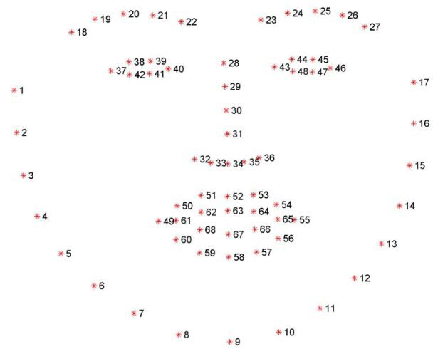
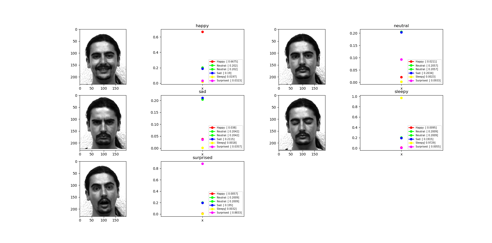
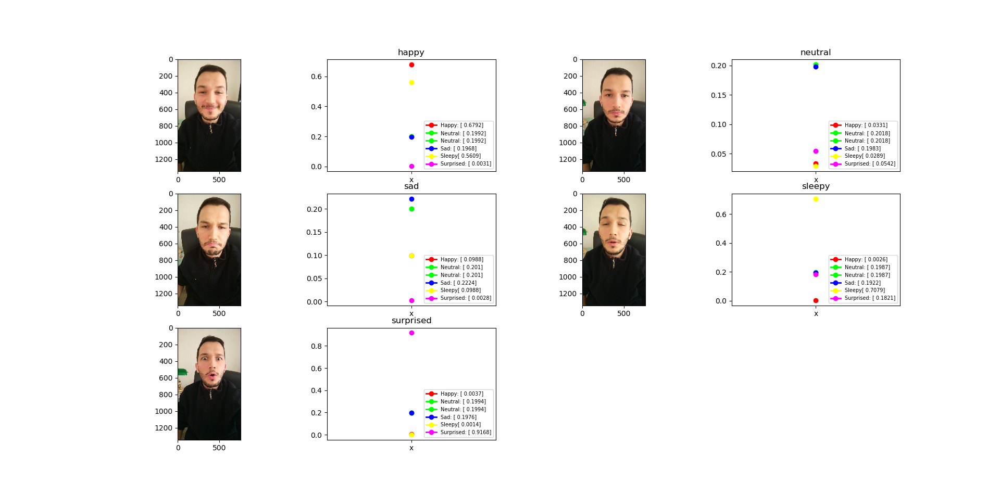

Computer Vision - Facial Expression Recognition
===============================================

### Introduction
This project is created for facial expressions recognition.

### How to use?
This project uses _dlib_. To use _dlib_ in windows, you need to _Anaconda_ environment. To install _Anaconda_ and _dlib_ in windows, you can follow this [tutorial](https://www.learnopencv.com/install-opencv-3-and-dlib-on-windows-python-only/). When you run the _"main.py"_, there will be 4 options you can select:

1) **Create dataset:** Dataset is created in the "dataset.txt" file. It is in the "machine_learning" directory. Dataset is created by using images which are under the "database" directory. Its mechanism is described at below. If you want to create your own dataset with your image database, delete old images and put your own images. It is useful. :)
2) **Train Model:** 5 models are created under the "machine_learning" directory. Models are trained using the created dataset.
3) **Test:** Images are tested which are under the "test_images" directory. When you want to change directory, you need to change "machine_learning.py" file which is under "machine_learning" directory. If you want to test with your images, put your images with the same names.
4) **Exit:** Program ends.

### Algorithm Overview
In this project, we are able to recognize five facial expression: 

1) happy
2) neutral
3) sad
4) sleepy
5) surprised

Recognition of facial expressions consists of 4 steps:

1) Detecting the locations of facial landmarks: eyebrows, eyes, nose, mouth and jaw
2) Creating a dataset by deriving 12 attributes which are calculated using location and shape of the facial landmarks
3) Training a model for each facial expression by using the created dataset
4) Testing

In the following, details of the steps are described.

#### Step 1 - Facial Landmarks Detection
To detect facial landmarks, _"facial landmark detector"_ is used. It is a pretrained model of _"dlib"_ library. This pretrained model detects facial landmarks by 68 points at the given image. The details of 68 points are like as following:

* Jaw - 18 points
* Right eyebrow – 5 points
* Left eyebrow – 5 points
* Nose – 8 points
* Right eye – 6 points
* Left eye – 6 points
* Mouth – 20 points

Order of the points are shown in the following picture.

#### Step 2 - Creating Dataset
At this step, _**Yale**_ database images are used to create dataset. In the database, there are 13 persons and many facial expressions of the persons. Because of having 5 expressions in our project, 13x5=65 images are used from the database. 5 images are separated from creating dataset. Because, they are used for testing. For each image, 68 points are found by processing the first step. Then, 12 attributes are found for creating dataset. 12 attributes are found by using the following formulas:

* Mouth height / Jaw height
* Mouth width / Jaw width
* Nose width / Jaw width
* Left eyebrow height / Left eyebrow width
* Distance between the left eye and eyebrow / Left eyebrow width
* Left eye height / Left eye width
* Right eye height / Right eye width
* Left eye height / Distance between the left eye and eyebrow
* Right eye height / Distance between the right eye and eyebrow
* Mouth height / Mouth width
* Difference of nose min y coordinate and mouth max y coordinate / Mouth height
* Difference nose min y coordinate and mouth min y coordinate / Mouth height

After calculating these attributes for each image, dataset is created which consists of 60 rows and 13 attributes. 12 attributes were mentioned above. 13th attribute is the facial expression of the image. 13th attribute is assigned 1 if expression is happy, assigned 2 if expression is neutral, assigned 3 if expression is sad, assigned 4 if expression is sleepy, assigned 5 if expression is surprised.

#### Step 3 - Model Training
The main objective of this step is machine learning. Machine learning is implemented by using Scikit learn. Support Vector Machine is used as a classifier. At this step, models are trained by using the dataset which is created at the second step. There is a different model for each facial expression. Model are named as the following:

* Happy model
* Neutral model
* Sad model
* Sleepy model
* Surprised model

Models are trained by manipulating 13th attributes in the dataset. For instance, if sad model will be trained, 13th attributes of 48 rows are changed to 0. Then, 13th attribute of 12 rows are changed to 1 which were 3. They were 3, because 3 represents "sad" as we mentioned before. First, 12 attributes are used to train models and 13th attribute is given as a result parameter of the scikit learn.

#### Step 4 -Step - Test
At this step, test images are tested. To test an image, 68 points are derived as mentioned in the first step. Then, 12 attributes are calculated as mentioned in the second step. Next, predictions are made by trained models which are trained in the third step. Facial expression prediction of the test image is decided according to a trained model which has highest prediction score. For instance, if happy model has the highest prediction score, our facial expression prediction is “Happy”.

### Experimental Results
After processing 4th step, a graphic has been created to show results. At below, test results of the first person are shown:

The prediction score of the models are can be seen on the right bottom of the images. As seen in the pictures, facial expressions of the images are predicted successfully. However, the success we define is not the rate of the prediction. The success we define is the big margin between the two highest predictions. As seen in the test results, recognition of “Happy”, “Sleepy” and “Surprised is successful. Recognition of “sad” and “Neutral” is true but less successful than other facial expressions. Because, margin of the two highest predictions is very low. It may cause wrong predictions at other test images.

After reaching considerable results, facial expressions in the real pictures are tested. At below, test results are shown:

Even though, the algorithm is very successful at predicting “happy”, “sleepy” and “surprised”, not good at predicting “sad” and “neutral. Because, their predictions are always very close to each other. More district attributes and bigger dataset can solve the problem.

### References
_**Yale**_ database can be reached from this [link](https://vismod.media.mit.edu/vismod/classes/mas622-00/datasets/). 

### License
Copyright 2019 Burak Kuyucu

Licensed under the Apache License, Version 2.0 (the "License");
you may not use this file except in compliance with the License.
You may obtain a copy of the License at

http://www.apache.org/licenses/LICENSE-2.0

Unless required by applicable law or agreed to in writing, software
distributed under the License is distributed on an "AS IS" BASIS,
WITHOUT WARRANTIES OR CONDITIONS OF ANY KIND, either express or implied.
See the License for the specific language governing permissions and
limitations under the License.

